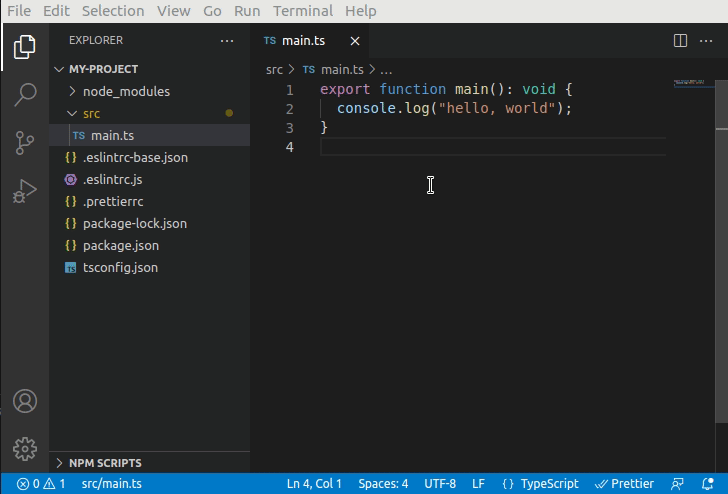
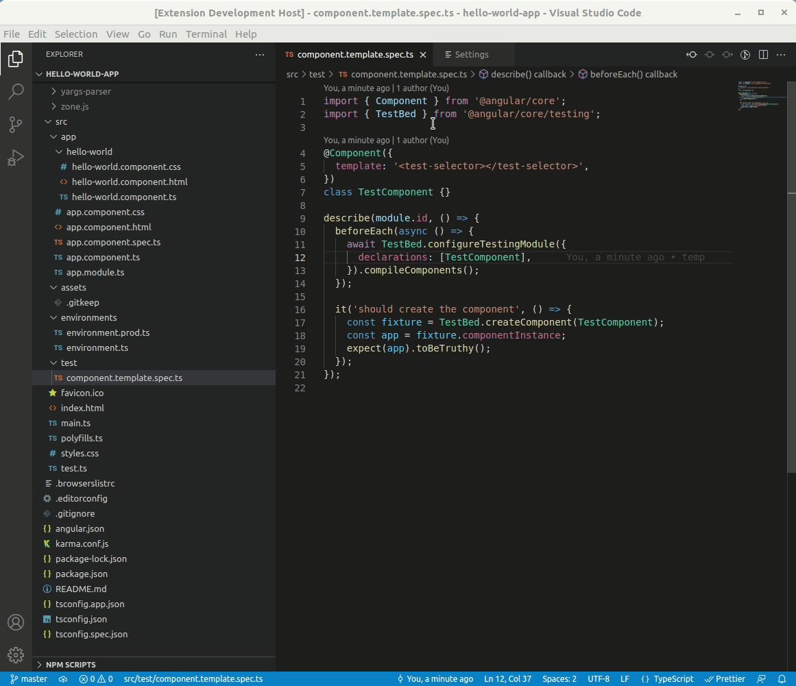

# Angular File Creator

## Features

Create Angular components, modules, and directives quickly in VS Code by right clicking folders in the explorer.

Create TypeScript and Angular unit tests quickly in VS Code by right clicking TypeScript files in the explorer.

## Configuration

`prefix`

Chose the words to appear before each class name, file name, and selector for Angular components, modules, and
directives.
